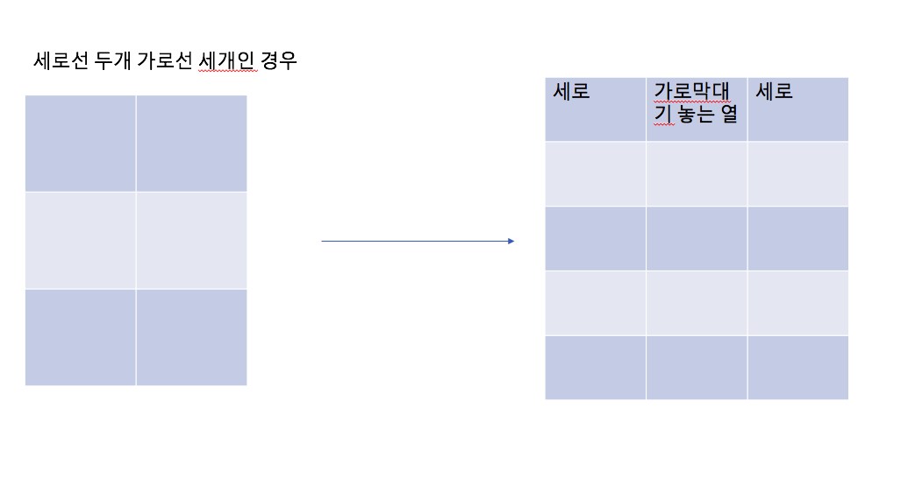

# Link to Question
(브루트 포스) 사다리 조작: https://www.acmicpc.net/problem/15684
2시간 40분 : 시간초과가 나서 그뒤로는 그냥 계속 풀기로 함

## Question Summary

## My solution summary
기억하자... 배열을 절대로 복사하지 않도록..... 
코드가 잘못 된줄 알았더니, 전역변수 바로참조하도록 했더니 바로 해결됬다. 그러니까 약 한 두시간을 그냥 날려먹었는데, 
절대로 이제 복사를 시키지 않도록 해야겠다고 깨달은 시간이었다... 기억하자...

- game: 두배로 키워놨다. 근데 풀고보니까 가로방향은 굳이 두배 안키워도 됬던거같다. 
    
  
- isBack 함수는 시작한 세로선으로 돌아오는지 해당 선에 대해서 검사하는 함수이다
  ```c++
    int x = 1;
    int y = start;

    while(x < 2 * h){
        if(game[x + dx[0]][y + dy[0]] == 2){
            // 2이면 오른쪽으로 간다.
            x += (dx[0] + 2); // 한칸 내려도 간다
            y += (dy[0] + 1);
        }else if(game[x + dx[2]][y + dy[2]] == 2) {
            // 2이면 왼쪽을로 간다
            x += (dx[2] + 2); // 한칸 내려도 간다
            y += (dy[2] - 1);
        }else{
            x += (dx[1] + 1); // 아래 방향인데, 사실상 두칸 내려가야한다
            y += dy[1];
        }
    }
    return y == (start);
    ```
    해당 함수내의 모양은 이렇다. 
    
    - 좌우 이동할때  dx[0] + 2 이런식으로 표현한 이유
        - 이 게임에서는 좌우하 방향으로 움직이는데, 좌로 움직이면 바로 아래방향으로 대려가줘도 된다.(안그러면 좌로 이동한다음에 다시 우로 이동할려고 그럼) 우방향도 똑같다. 
        - 좌우 방향일때 2만큼 내려가는건 격자를 두배로 키워놔서 실제로 아래방향으로 이동하는건 두칸 밑으로 내려가는거다
        - (dy[0] + 1) 이렇게 표현한 것도 옆에 기둥으로 이동하는게 사실상 2 개를 이동해야하는 거다
    
   

- bool isThisAnswer(): 모든 세로 선에 대해서 다 원래대로 돌아오는지 검사해서 그렇다면 true를 반환하는 함수이다
- i=0 (막대기 0개) 에서 i=3(막대기 3개) 세울때까지 경로를 직접 만들어 본다
    ```c++
    for(int i = 0; i <= 3; i++){
        if(makeRoute(i)){
            cout << i << "\n";
            return 0;
        }
    }
    ```
- bool makeRoute(int c): 해당하는 갯수만큼 막대기를 놓는다. 이때 많아봤자 300 *299 *298 개 정도 조합을 구하는 것이라 브루트포스하게 조합을 구해도 된다. 문제에서 준 몇개의 조건을 고려한다. 


- 최종 코드
```c++
#include <iostream>
#include <vector>
#include <algorithm>
#include <queue>

using namespace std;

int n, m, h;

vector<vector<int>> game(30 * 2 + 1, vector<int> (10 * 2 + 1, 0)); // 중간에 가로선 하는 것도
vector<vector<int>> visited(30 + 1, vector<int> (10 + 1, 0)); // 가로선 놓인 곳 체크
vector<pair<int, int>> notVisited;

int dx[3] = {0, 1, 0};
int dy[3] = {1, 0, -1};

bool isBack(int start){
    int x = 1;
    int y = start;

    while(x < 2 * h){
        if(game[x + dx[0]][y + dy[0]] == 2){
            // 2이면 오른쪽으로 간다.
            x += (dx[0] + 2); // 한칸 내려도 간다
            y += (dy[0] + 1);
        }else if(game[x + dx[2]][y + dy[2]] == 2) {
            // 2이면 왼쪽을로 간다
            x += (dx[2] + 2); // 한칸 내려도 간다
            y += (dy[2] - 1);
        }else{
            x += (dx[1] + 1); // 아래 방향인데, 사실상 두칸 내려가야한다
            y += dy[1];
        }
    }
    return y == (start);
}

bool isThisAnswer() {
    bool result = true;
    for(int j = 1; j < n * 2; j+=2){
        if(!isBack(j)){
            result = false;
            break;
        }
    }
    return result;
}

bool makeRoute(int c){
    // notVisited 에 있는거 다 해보기
    // 그냥 바로 해보기
    if(c == 0){
        if(isThisAnswer()){
            return true;
        }
    }

    else if(c == 1 && notVisited.size() >= 1){
        // notVisited 에 있는거 다 해보기
        for(int i = 0; i < notVisited.size(); i++){
            game[notVisited[i].first * 2 - 1][notVisited[i].second * 2] = 2;
            if(isThisAnswer()){
                return true;
            }
            game[notVisited[i].first * 2 - 1][notVisited[i].second * 2] = 0;
        }
    }

    else if(c == 2 && notVisited.size() >= 2){
        for(int i = 0; i < notVisited.size(); i++){
            game[notVisited[i].first * 2 - 1][notVisited[i].second * 2] = 2;

            for(int j = i+1; j < notVisited.size(); j++){
                // i j 가 같은 높이에 있을때는 연달아 있으면 안된다
                if(notVisited[i].first == notVisited[j].first){
                    if(notVisited[i].second - notVisited[j].second == 1 || notVisited[j].second - notVisited[j].second == -1){
                        continue;
                    }
                }

                if(notVisited[i].second == notVisited[j].second){
                    if(notVisited[i].first - notVisited[j].first == 1 || notVisited[i].first - notVisited[j].first == -1){
                        continue;
                    }
                }

                game[notVisited[j].first * 2 - 1][notVisited[j].second * 2] = 2;
                if(isThisAnswer()){
                    return true;
                }

                game[notVisited[j].first * 2 - 1][notVisited[j].second * 2] = 0;
            }

            game[notVisited[i].first * 2 - 1][notVisited[i].second * 2] = 0;
        }
    }

    else if(c == 3 && notVisited.size() >= 3){
        // notVisited 에 있는거 다 해보기
        for(int i = 0; i < notVisited.size(); i++){
            game[notVisited[i].first * 2 - 1][notVisited[i].second * 2] = 2;
            for(int j = i+1; j < notVisited.size(); j++){
                // i j 가 같은 높이에 있을때는 연달아 있으면 안된다
                if(notVisited[i].first == notVisited[j].first){
                    if(notVisited[i].second - notVisited[j].second == 1 || notVisited[j].second - notVisited[j].second == -1){
                        continue;
                    }
                }

                if(notVisited[i].second == notVisited[j].second){
                    if(notVisited[i].first - notVisited[j].first == 1 || notVisited[i].first - notVisited[j].first == -1){
                        continue;
                    }
                }

                game[notVisited[j].first * 2 - 1][notVisited[j].second * 2] = 2;
                for(int k = j+1; k < notVisited.size(); k++){
                    // i k 가 같은 높이에 있을때는 연달아 있으면 안된다
                    if(notVisited[i].first == notVisited[k].first){
                        if(notVisited[i].second - notVisited[k].second == 1 || notVisited[j].second - notVisited[k].second == -1){
                            continue;
                        }
                    }

                    // j k 가 같은 높이에 있을때는 연달아 있으면 안된다
                    if(notVisited[k].second == notVisited[j].second){
                        if(notVisited[k].first - notVisited[j].first == 1 || notVisited[k].first - notVisited[j].first == -1){
                            continue;
                        }
                    }


                    game[notVisited[k].first * 2 - 1][notVisited[k].second * 2] = 2;
                    if(isThisAnswer()){
                        return true;
                    }

                    game[notVisited[k].first * 2 - 1][notVisited[k].second * 2] = 0;

//                    cout << i << " " << j << " " << k << "\n";
                }


                game[notVisited[j].first * 2 - 1][notVisited[j].second * 2] = 0;
            }
            game[notVisited[i].first * 2 - 1][notVisited[i].second * 2] = 0;
        }
    }
    return false;
}

int main() {
    cin >> n >> m >> h;

    for(int i = 1; i < h * 2; i++){
        for(int j = 1; j < n * 2; j+=2){
            game[i][j] = 1;
        }
    }

    for(int i = 0; i < m; i++){
        int a, b;
        cin >> a >> b; // b 가 세로선 선택, a가 가로선 선택
        int na = 2 * a - 1;
        int nb = 2 * b;
        game[na][nb] = 2;
        visited[a][b] = 1;
    }

    if(m == 0){
        cout << 0 << "\n";
        return 0;
    }


    for(int i = 1; i < h+1; i++){
        for(int j = 1; j < n; j++){
            if(visited[i][j] == 0) {
                if(j+1 <= n && visited[i][j+1] != 1){
                    if(j - 1 >= 0 && visited[i][j-1] != 1){
                        notVisited.push_back({i, j});
                    }
                }
            }
        }
    }


    for(int i = 0; i <= 3; i++){
        if(makeRoute(i)){
            cout << i << "\n";
            return 0;
        }
    }

    cout << -1 << "\n";

    return 0;
}
```


## My code
1. 시간 초과 나는 코드
```c++
#include <iostream>
#include <vector>
#include <algorithm>
#include <queue>

using namespace std;

int n, m, h;

vector<vector<int>> game(30 * 2 + 1, vector<int> (10 * 2 + 1, 0)); // 중간에 가로선 하는 것도
vector<vector<int>> visited(30 + 1, vector<int> (10 + 1, 0)); // 가로선 놓인 곳 체크
vector<pair<int, int>> notVisited;

int dx[3] = {0, 1, 0};
int dy[3] = {1, 0, -1};

void printBoard(int row, int col, vector<vector<int>> board){
    for(int i = 1; i < row; i++){
        for(int j = 1; j < col; j++){
            cout << board[i][j] << " ";
        }
        cout << "\n";
    }
}

bool isBack(int start, vector<vector<int>> game){
    int x = 1;
    int y = start;
//    cout << "route start \n";

    while(x < 2 * h){
//        cout << "현재 위치" << x << " " << y << "\n";
        if(game[x + dx[0]][y + dy[0]] == 2){
            // 2이면 오른쪽으로 간다.
            x += (dx[0] + 2); // 한칸 내려도 간다
            y += (dy[0] + 1);
        }else if(game[x + dx[2]][y + dy[2]] == 2) {
            // 2이면 왼쪽을로 간다
            x += (dx[2] + 2); // 한칸 내려도 간다
            y += (dy[2] - 1);
        }else{
            x += (dx[1] + 1); // 아래 방향인데, 사실상 두칸 내려가야한다
            y += dy[1];
        }
    }
//    cout << "끝" << start<< ", " << y << "\n";
    return y == (start);
}

bool isThisAnswer(vector<vector<int>> game) {
    bool result = true;
    for(int j = 1; j < n * 2; j+=2){
        if(!isBack(j, game)){
            result = false;
            break;
        }
    }
    return result;
}

bool makeRoute(vector<vector<int>> game, vector<vector<int>> visited, int c){
    if(c == 1 && notVisited.size() >= 1){
        // notVisited 에 있는거 다 해보기
        for(int i = 0; i < notVisited.size(); i++){
            game[notVisited[i].first * 2 - 1][notVisited[i].second * 2] = 2;
//            printBoard(h*2, n*2, game);
            if(isThisAnswer(game)){
                return true;
            }
            game[notVisited[i].first * 2 - 1][notVisited[i].second * 2] = 0;
        }
    }else if(c == 2 && notVisited.size() >= 2){
        for(int i = 0; i < notVisited.size(); i++){
            for(int j = i+1; j < notVisited.size(); j++){
                if(notVisited[i].first * 2 - 1 == notVisited[j].first * 2 - 1){
                   int diff = notVisited[i].second * 2 - notVisited[j].second * 2;
                   if(diff == 2 || diff == -2){
                       continue; // 연달아 붙어있으면 검사 x
                   }
                }
                game[notVisited[i].first * 2 - 1][notVisited[i].second * 2] = 2;
                game[notVisited[j].first * 2 - 1][notVisited[j].second * 2] = 2;
                if(isThisAnswer(game)){
                    return true;
                }
                game[notVisited[i].first * 2 - 1][notVisited[i].second * 2] = 0;
                game[notVisited[j].first * 2 - 1][notVisited[j].second * 2] = 0;
            }
        }
    }else if(c == 3 && notVisited.size() >= 3){
        for(int k = 0; k < notVisited.size(); k++) {
            for (int i = k + 1; i < notVisited.size(); i++) {

                // k와 i가 연달아,
                if(notVisited[i].first * 2 - 1 == notVisited[k].first * 2 - 1){
                    int diff = notVisited[i].second * 2 - notVisited[k].second * 2;
                    if(diff == 2 || diff == -2){
                        continue; // 연달아 붙어있으면 검사 x
                    }
                }

                for (int j = i + 1; j < notVisited.size(); j++) {
                    // k와 j가 연달아
                    if(notVisited[j].first * 2 - 1 == notVisited[k].first * 2 - 1){
                        int diff = notVisited[j].second * 2 - notVisited[k].second * 2;
                        if(diff == 2 || diff == -2){
                            continue; // 연달아 붙어있으면 검사 x
                        }
                    }

                    // i와 j가 연달아
                    if(notVisited[i].first * 2 - 1 == notVisited[j].first * 2 - 1){
                        int diff = notVisited[i].second * 2 - notVisited[j].second * 2;
                        if(diff == 2 || diff == -2){
                            continue; // 연달아 붙어있으면 검사 x
                        }
                    }


                    game[notVisited[k].first * 2 - 1][notVisited[k].second * 2] = 2;
                    game[notVisited[i].first * 2 - 1][notVisited[i].second * 2] = 2;
                    game[notVisited[j].first * 2 - 1][notVisited[j].second * 2] = 2;
                    if (isThisAnswer(game)) {
                        return true;
                    }
                    game[notVisited[k].first * 2 - 1][notVisited[k].second * 2] = 0;
                    game[notVisited[i].first * 2 - 1][notVisited[i].second * 2] = 0;
                    game[notVisited[j].first * 2 - 1][notVisited[j].second * 2] = 0;
                }
            }
        }
    }


    return false;
}

int main() {
    cin >> n >> m >> h;

    for(int i = 1; i < h * 2; i++){
        for(int j = 1; j < n * 2; j+=2){
            game[i][j] = 1;
        }
    }

    for(int i = 0; i < m; i++){
        int a, b;
        cin >> a >> b; // b 가 세로선 선택, a가 가로선 선택
        int na = 2 * a - 1;
        int nb = 2 * b;
        game[na][nb] = 2;
        visited[a][b] = 1;
    }

    if(m == 0){
        cout << 0 << "\n";
        return 0;
    }

    for(int i = 1; i < h+1; i++){
        for(int j = 1; j < n; j++){
            if(visited[i][j] == 0) {
                notVisited.push_back({i, j});
            }
        }
    }

//    cout << notVisited.size() << "\n";
//
//    printBoard(h*2, n*2, game);
//
//    cout << "\n";

//    printBoard(h+1, n, visited);
//
    for(int i = 1; i <= 3; i++){
        if(makeRoute(game, visited, i)){
            cout << i << "\n";
            return 0;
        }
    }
//
    cout << -1 << "\n";

    return 0;
}
```


2. 조금 개선한것..
```c++
#include <iostream>
#include <vector>
#include <algorithm>
#include <queue>

using namespace std;

int n, m, h;

vector<vector<int>> game(30 * 2 + 1, vector<int> (10 * 2 + 1, 0)); // 중간에 가로선 하는 것도
vector<vector<int>> visited(30 + 1, vector<int> (10 + 1, 0)); // 가로선 놓인 곳 체크
vector<pair<int, int>> notVisited;

int dx[3] = {0, 1, 0};
int dy[3] = {1, 0, -1};

void printBoard(int row, int col, vector<vector<int>> board){
    for(int i = 1; i < row; i++){
        for(int j = 1; j < col; j++){
            cout << board[i][j] << " ";
        }
        cout << "\n";
    }
}

bool isBack(int start, vector<vector<int>> game){
    int x = 1;
    int y = start;
//    cout << "route start \n";

    while(x < 2 * h){
//        cout << "현재 위치" << x << " " << y << "\n";
        if(game[x + dx[0]][y + dy[0]] == 2){
            // 2이면 오른쪽으로 간다.
            x += (dx[0] + 2); // 한칸 내려도 간다
            y += (dy[0] + 1);
        }else if(game[x + dx[2]][y + dy[2]] == 2) {
            // 2이면 왼쪽을로 간다
            x += (dx[2] + 2); // 한칸 내려도 간다
            y += (dy[2] - 1);
        }else{
            x += (dx[1] + 1); // 아래 방향인데, 사실상 두칸 내려가야한다
            y += dy[1];
        }
    }
//    cout << "끝" << start<< ", " << y << "\n";
    return y == (start);
}

bool isThisAnswer(vector<vector<int>> game) {
    bool result = false;
    for(int j = 1; j < n * 2; j+=2){
        if(!isBack(j, game)){
            result = false;
            break;
        }
    }
    return result;
}

bool makeRoute(vector<vector<int>> game, vector<vector<int>> visited, int c){
    if(c == 0) {
        if (isThisAnswer(game)) {
            return true;
        }
    }
    else if(c == 1 && notVisited.size() >= 1){
        // notVisited 에 있는거 다 해보기
        for(int i = 0; i < notVisited.size(); i++){
            game[notVisited[i].first * 2 - 1][notVisited[i].second * 2] = 2;
            if(isThisAnswer(game)){
                return true;
            }
            game[notVisited[i].first * 2 - 1][notVisited[i].second * 2] = 0;
        }
    }
    else if(c == 2 && notVisited.size() >= 2){
        for(int i = 0; i < notVisited.size(); i++){
            game[notVisited[i].first * 2 - 1][notVisited[i].second * 2] = 2;

            for(int j = i+1; j < notVisited.size(); j++){
                // i j 가 같은 높이에 있을때는 연달아 있으면 안된다
                if(notVisited[i].first == notVisited[j].first){
                    if(notVisited[i].second - notVisited[j].second == 1 || notVisited[j].second - notVisited[j].second == -1){
                        continue;
                    }
                }

                if(notVisited[i].second == notVisited[j].second){
                    if(notVisited[i].first - notVisited[j].first == 1 || notVisited[i].first - notVisited[j].first == -1){
                        continue;
                    }
                }

//                cout << i << " " << j << " " << "\n";

                game[notVisited[j].first * 2 - 1][notVisited[j].second * 2] = 2;
                if(isThisAnswer(game)){
                    return true;
                }

                game[notVisited[j].first * 2 - 1][notVisited[j].second * 2] = 0;
            }

            game[notVisited[i].first * 2 - 1][notVisited[i].second * 2] = 0;
        }
    }
    else if(c == 3 && notVisited.size() >= 3){
        // notVisited 에 있는거 다 해보기
        for(int i = 0; i < notVisited.size(); i++){
            game[notVisited[i].first * 2 - 1][notVisited[i].second * 2] = 2;
            for(int j = i+1; j < notVisited.size(); j++){
                // i j 가 같은 높이에 있을때는 연달아 있으면 안된다
                if(notVisited[i].first == notVisited[j].first){
                    if(notVisited[i].second - notVisited[j].second == 1 || notVisited[j].second - notVisited[j].second == -1){
                        continue;
                    }
                }

                if(notVisited[i].second == notVisited[j].second){
                    if(notVisited[i].first - notVisited[j].first == 1 || notVisited[i].first - notVisited[j].first == -1){
                        continue;
                    }
                }

                game[notVisited[j].first * 2 - 1][notVisited[j].second * 2] = 2;
                for(int k = j+1; k < notVisited.size(); k++){
                    // i k 가 같은 높이에 있을때는 연달아 있으면 안된다
                    if(notVisited[i].first == notVisited[k].first){
                        if(notVisited[i].second - notVisited[k].second == 1 || notVisited[j].second - notVisited[k].second == -1){
                            continue;
                        }
                    }

                    // j k 가 같은 높이에 있을때는 연달아 있으면 안된다
                    if(notVisited[k].second == notVisited[j].second){
                        if(notVisited[k].first - notVisited[j].first == 1 || notVisited[k].first - notVisited[j].first == -1){
                            continue;
                        }
                    }


                    game[notVisited[k].first * 2 - 1][notVisited[k].second * 2] = 2;
                    if(isThisAnswer(game)){
                        return true;
                    }

                    game[notVisited[k].first * 2 - 1][notVisited[k].second * 2] = 0;

//                    cout << i << " " << j << " " << k << "\n";
                }


                game[notVisited[j].first * 2 - 1][notVisited[j].second * 2] = 0;
            }
            game[notVisited[i].first * 2 - 1][notVisited[i].second * 2] = 0;
        }
    }


    return false;
}

int main() {
    cin >> n >> m >> h;

    for(int i = 1; i < h * 2; i++){
        for(int j = 1; j < n * 2; j+=2){
            game[i][j] = 1;
        }
    }

    for(int i = 0; i < m; i++){
        int a, b;
        cin >> a >> b; // b 가 세로선 선택, a가 가로선 선택
        int na = 2 * a - 1;
        int nb = 2 * b;
        game[na][nb] = 2;
        visited[a][b] = 1;
    }

    if(m == 0){
        cout << 0 << "\n";
        return 0;
    }


    for(int i = 1; i < h+1; i++){
        for(int j = 1; j < n; j++){
            if(visited[i][j] == 0) {
                if(j+1 <= n && visited[i][j+1] != 1){
                    if(j - 1 >= 0 && visited[i][j-1] != 1){
                        notVisited.push_back({i, j});
                    }
                }
            }
        }
    }

//    cout << notVisited.size() << "\n";

//    printBoard(h*2, n*2, game);
//
//    cout << "\n";

//    printBoard(h+1, n, visited);
//    cout << "\n";

//    printBoard(h+1, n, visited);

    for(int i = 0; i <= 3; i++){
        if(makeRoute(game, visited, i)){
            cout << i << "\n";
            return 0;
        }
    }

    cout << -1 << "\n";

    return 0;
}
```


3. 되는 코드
```c++
#include <iostream>
#include <vector>
#include <algorithm>
#include <queue>

using namespace std;

int n, m, h;

vector<vector<int>> game(30 * 2 + 1, vector<int> (10 * 2 + 1, 0)); // 중간에 가로선 하는 것도
vector<vector<int>> visited(30 + 1, vector<int> (10 + 1, 0)); // 가로선 놓인 곳 체크
vector<pair<int, int>> notVisited;

int dx[3] = {0, 1, 0};
int dy[3] = {1, 0, -1};

void printBoard(int row, int col, vector<vector<int>> board){
    for(int i = 1; i < row; i++){
        for(int j = 1; j < col; j++){
            cout << board[i][j] << " ";
        }
        cout << "\n";
    }
}

bool isBack(int start){
    int x = 1;
    int y = start;
//    cout << "route start \n";

    while(x < 2 * h){
//        cout << "현재 위치" << x << " " << y << "\n";
        if(game[x + dx[0]][y + dy[0]] == 2){
            // 2이면 오른쪽으로 간다.
            x += (dx[0] + 2); // 한칸 내려도 간다
            y += (dy[0] + 1);
        }else if(game[x + dx[2]][y + dy[2]] == 2) {
            // 2이면 왼쪽을로 간다
            x += (dx[2] + 2); // 한칸 내려도 간다
            y += (dy[2] - 1);
        }else{
            x += (dx[1] + 1); // 아래 방향인데, 사실상 두칸 내려가야한다
            y += dy[1];
        }
    }
//    cout << "끝" << start<< ", " << y << "\n";
    return y == (start);
}

bool isThisAnswer() {
    bool result = true;
    for(int j = 1; j < n * 2; j+=2){
        if(!isBack(j)){
            result = false;
            break;
        }
    }
    return result;
}

bool makeRoute(int c){
    // notVisited 에 있는거 다 해보기
    // 그냥 바로 해보기
    if(c == 0){
        if(isThisAnswer()){
            return true;
        }
    }

    else if(c == 1 && notVisited.size() >= 1){
        // notVisited 에 있는거 다 해보기
        for(int i = 0; i < notVisited.size(); i++){
            game[notVisited[i].first * 2 - 1][notVisited[i].second * 2] = 2;
            if(isThisAnswer()){
                return true;
            }
            game[notVisited[i].first * 2 - 1][notVisited[i].second * 2] = 0;
        }
    }

    else if(c == 2 && notVisited.size() >= 2){
        for(int i = 0; i < notVisited.size(); i++){
            game[notVisited[i].first * 2 - 1][notVisited[i].second * 2] = 2;

            for(int j = i+1; j < notVisited.size(); j++){
                // i j 가 같은 높이에 있을때는 연달아 있으면 안된다
                if(notVisited[i].first == notVisited[j].first){
                    if(notVisited[i].second - notVisited[j].second == 1 || notVisited[j].second - notVisited[j].second == -1){
                        continue;
                    }
                }

                if(notVisited[i].second == notVisited[j].second){
                    if(notVisited[i].first - notVisited[j].first == 1 || notVisited[i].first - notVisited[j].first == -1){
                        continue;
                    }
                }

                game[notVisited[j].first * 2 - 1][notVisited[j].second * 2] = 2;
                if(isThisAnswer()){
                    return true;
                }

                game[notVisited[j].first * 2 - 1][notVisited[j].second * 2] = 0;
            }

            game[notVisited[i].first * 2 - 1][notVisited[i].second * 2] = 0;
        }
    }

    else if(c == 3 && notVisited.size() >= 3){
        // notVisited 에 있는거 다 해보기
        for(int i = 0; i < notVisited.size(); i++){
            game[notVisited[i].first * 2 - 1][notVisited[i].second * 2] = 2;
            for(int j = i+1; j < notVisited.size(); j++){
                // i j 가 같은 높이에 있을때는 연달아 있으면 안된다
                if(notVisited[i].first == notVisited[j].first){
                    if(notVisited[i].second - notVisited[j].second == 1 || notVisited[j].second - notVisited[j].second == -1){
                        continue;
                    }
                }

                if(notVisited[i].second == notVisited[j].second){
                    if(notVisited[i].first - notVisited[j].first == 1 || notVisited[i].first - notVisited[j].first == -1){
                        continue;
                    }
                }

                game[notVisited[j].first * 2 - 1][notVisited[j].second * 2] = 2;
                for(int k = j+1; k < notVisited.size(); k++){
                    // i k 가 같은 높이에 있을때는 연달아 있으면 안된다
                    if(notVisited[i].first == notVisited[k].first){
                        if(notVisited[i].second - notVisited[k].second == 1 || notVisited[j].second - notVisited[k].second == -1){
                            continue;
                        }
                    }

                    // j k 가 같은 높이에 있을때는 연달아 있으면 안된다
                    if(notVisited[k].second == notVisited[j].second){
                        if(notVisited[k].first - notVisited[j].first == 1 || notVisited[k].first - notVisited[j].first == -1){
                            continue;
                        }
                    }


                    game[notVisited[k].first * 2 - 1][notVisited[k].second * 2] = 2;
                    if(isThisAnswer()){
                        return true;
                    }

                    game[notVisited[k].first * 2 - 1][notVisited[k].second * 2] = 0;

//                    cout << i << " " << j << " " << k << "\n";
                }


                game[notVisited[j].first * 2 - 1][notVisited[j].second * 2] = 0;
            }
            game[notVisited[i].first * 2 - 1][notVisited[i].second * 2] = 0;
        }
    }


//    for(int i = 0; i < notVisited.size(); i++){
//        // 1개 가지고 바로 검사
//        game[notVisited[i].first * 2 - 1][notVisited[i].second * 2] = 2;
//        if(isThisAnswer()){
//            return 1;
//        }
//
//
//        for(int j = i+1; j < notVisited.size(); j++){
//            // 2개 가지고 검사
//            // i j 가 같은 높이에 있을때는 연달아 있으면 안된다
//            if(notVisited[i].first == notVisited[j].first){
//                if(notVisited[i].second - notVisited[j].second == 1 || notVisited[j].second - notVisited[j].second == -1){
//                    continue;
//                }
//            }
//            if(notVisited[i].second == notVisited[j].second){
//                if(notVisited[i].first - notVisited[j].first == 1 || notVisited[i].first - notVisited[j].first == -1){
//                    continue;
//                }
//            }
//
//            game[notVisited[j].first * 2 - 1][notVisited[j].second * 2] = 2;
//            if(isThisAnswer()){
//                return 2;
//            }
//
//            for(int k = j+1; k < notVisited.size(); k++){
//                // 3개 가지고 검사
//                // i k 가 같은 높이에 있을때는 연달아 있으면 안된다
//                if(notVisited[i].first == notVisited[k].first){
//                    if(notVisited[i].second - notVisited[k].second == 1 || notVisited[j].second - notVisited[k].second == -1){
//                        continue;
//                    }
//                }
//
//                // j k 가 같은 높이에 있을때는 연달아 있으면 안된다
//                if(notVisited[k].second == notVisited[j].second){
//                    if(notVisited[k].first - notVisited[j].first == 1 || notVisited[k].first - notVisited[j].first == -1){
//                        continue;
//                    }
//                }
//
//
//                game[notVisited[k].first * 2 - 1][notVisited[k].second * 2] = 2;
//                if(isThisAnswer()){
//                    return 3;
//                }
//                game[notVisited[k].first * 2 - 1][notVisited[k].second * 2] = 0;
//
////                cout << i << " " << j << " " << k << "\n";
//            }
//
//
//            game[notVisited[j].first * 2 - 1][notVisited[j].second * 2] = 0;
//        }
//        game[notVisited[i].first * 2 - 1][notVisited[i].second * 2] = 0;
//    }
//
    return false;
}

int main() {
    cin >> n >> m >> h;

    for(int i = 1; i < h * 2; i++){
        for(int j = 1; j < n * 2; j+=2){
            game[i][j] = 1;
        }
    }

    for(int i = 0; i < m; i++){
        int a, b;
        cin >> a >> b; // b 가 세로선 선택, a가 가로선 선택
        int na = 2 * a - 1;
        int nb = 2 * b;
        game[na][nb] = 2;
        visited[a][b] = 1;
    }

    if(m == 0){
        cout << 0 << "\n";
        return 0;
    }


    for(int i = 1; i < h+1; i++){
        for(int j = 1; j < n; j++){
            if(visited[i][j] == 0) {
                if(j+1 <= n && visited[i][j+1] != 1){
                    if(j - 1 >= 0 && visited[i][j-1] != 1){
                        notVisited.push_back({i, j});
                    }
                }
            }
        }
    }

//    cout << notVisited.size() << "\n";

//    printBoard(h*2, n*2, game);
//
//    cout << "\n";

//    printBoard(h+1, n, visited);
//    cout << "\n";

//    printBoard(h+1, n, visited);

    for(int i = 0; i <= 3; i++){
        if(makeRoute(i)){
            cout << i << "\n";
            return 0;
        }
    }

//    cout << makeRoute() << "\n";

    cout << -1 << "\n";

    return 0;
}
```