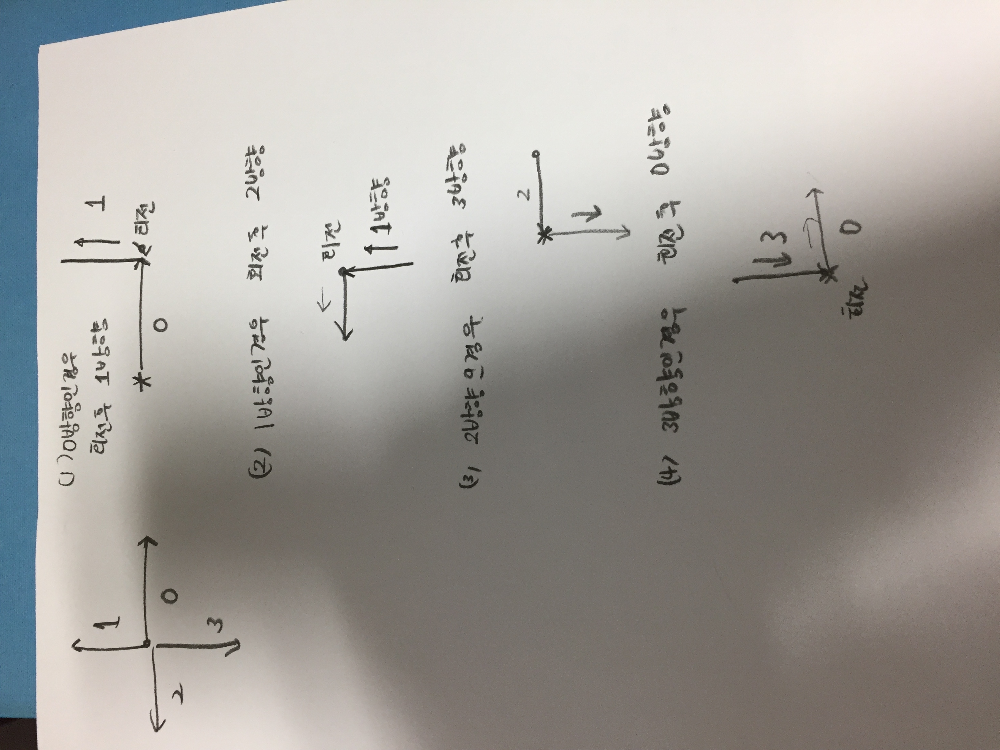

# Link to Question
(시뮬레이션) 드래곤 커브: https://www.acmicpc.net/problem/15685
## Question Summary

## My solution summary
문제가 뭔소린지 모르겠다. 

- 드래곤 커브라는걸 할건데, 얘의 시작을 준다 여러개
- 드래곤 커브를 만든 방향을 거꾸로 복원한다음에, 뒤집어서 연결

- 핵심 아이디어
  - 점가지고 계산할게 아니라 어떻게 왔는지 방향을 추적해서 회전 시켜야한다. 
    

  - track이라는 벡터는 이제까지 와온 경로를 저장한다. 원래 경로가 그려진 방향을 이 track을 통해서 기억하고 90도로 회전할때 어느방향으로 가야하는지를 계산해서 새로운 끝점을 매번 계산한다. 
    
    ```c++
    vector<int> track;
    // 0세대 설정

    //        cout << "시작" << "\n";
    //        cout << "0세대" << x << " " << y << "\n";
    visited[x][y] = 1;
    x += dx[d];
    y += dy[d];
    visited[x][y] = 1; // 표시
    track.push_back(d);


    for(int i = 1; i <= g; i++){
    //            cout << i << "세대" << x << " " << y << "\n";
        // 몇 번 이걸 반복하는지
        int currentTrackSize = track.size();
        for(int j =  currentTrackSize - 1; j >= 0; j--){
            // 새로 구해지는것도 넣는다.
            int nextDirection = rotate(track[j]);
            x += dx[nextDirection];
            y += dy[nextDirection];
            visited[x][y] = 1;
            track.push_back(nextDirection);
        }
    }
    ```

    `int nextDirection = rotate(track[j]);` 는 `track[j]`방향으로 그려진 경로를 현재 점 기준으로 90도 회전하면 어디로 가야하는지를 direction을 계산하는 부분이다. 이를 기반으로 새로운 점을 계산할 수 있다. 

    - box 갯수는 `getBox()` 함수에서 처리한다. 

- 후기
아주 낯설었다. 이렇게도 문제를 해결할 수 있단걸 알고 있으면 언젠가 도움이 될 것 같다. 


## My code
```c++
#include <iostream>
#include <vector>

using namespace std;

int n;
int visited[101][101];

int dx[4] = {1, 0, -1, 0};
int dy[4] = {0, -1, 0, 1};

int rotate(int direction){
    // 현재의 direction을 기준으로 어디로 이동해야하는지
    return direction + 1 != 4 ? direction +1 : 0;
}

int getBox(){
    int answer = 0;
    for(int i = 0; i <= 99; i++){
        for(int j = 0; j <= 99; j++){
            if(visited[i][j] == 1 && visited[i][j+1] == 1 && visited[i+1][j] == 1 && visited[i+1][j+1] == 1){
                answer++;
            }
        }
    }

    return answer;
}

int main() {
    cin >> n;

    while(n--){
        int x, y, d, g;
        cin >> x >> y >> d >> g;
        // x, y 시작점이자 끝점
        // d 시작방향
        // g 세대

        vector<int> track;
        // 0세대 설정

//        cout << "시작" << "\n";
//        cout << "0세대" << x << " " << y << "\n";
        visited[x][y] = 1;
        x += dx[d];
        y += dy[d];
        visited[x][y] = 1; // 표시
        track.push_back(d);


        for(int i = 1; i <= g; i++){
//            cout << i << "세대" << x << " " << y << "\n";
            // 몇 번 이걸 반복하는지
            int currentTrackSize = track.size();
            for(int j =  currentTrackSize - 1; j >= 0; j--){
                // 새로 구해지는것도 넣는다.
                int nextDirection = rotate(track[j]);
                x += dx[nextDirection];
                y += dy[nextDirection];
                visited[x][y] = 1;
                track.push_back(nextDirection);
            }
        }

//        cout << "마지막 끝점" << x << " " << y << "\n";
    }

    cout << getBox() << "\n";

    return 0;
}

```
