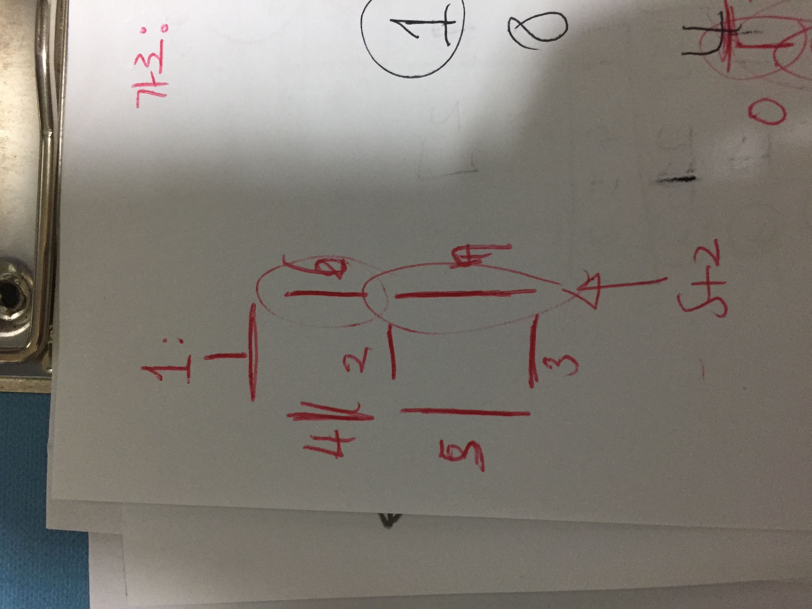

# Link to Question
(시뮬레이션) LCD Test: https://www.acmicpc.net/problem/2290

## Question Summary

## My solution summary
엄청난 노가다로 풀었다.... 분명히 더 쉬운 방법이 있을텐데, 내머리론..😢

- result를 출력하는 벡터를 선언해서 너비가 어찌됬든 여기에 다 표시한다(s에 관계없이)
- 이 백터를 읽으면서 높이가 `i == 0 || i == s+1 || i == 2*s+2` 일때는 `-`를 출력하고 그 외의 경우에는 `|` 를 출력한다. 
- 이때 공백인 열 건너뛸 수 있도록 s+2 간격마다 한번씩은 공백을 출력한다. 
- 공백이 아닌 열에서는 해당 숫자, 지금 숫자는 공백을 몇번 넘어왔는지로 체크한다. 공백을 한번도 안넘어왔으면 첫번째 숫자이고, 1번 넘어가면 2번째 숫자이다. 이는 `which`라는 변수로 확인
- `isVisible(num, i, j - (blank - (s+2))` 이런 함수를 구성했는데, 이건 해당 행과 열을 기준으로 해당 숫자 `num`이 보여야하는지 공백인지를 체크하는 함수이다. 이때 보여야되는곳이면 문자를 출력한다. 
- `isVisible`함수는 숫자마자 몇번째 파트가 보이는지를 체크한다. 



여기서 부터 각변의 번호를 매겼다. 

```c++
if(num == 1){
    if(checker(6, r, c) || checker(7, r, c)) {
        return true;
    }
}
```
숫자1의 경우 6번과 7번이 보이는 곳이다. 

- checker라는 함수는 변 번호와, 위치를 받아서 해당 위치에서 보이는게 맞는지 체크를 해준다. 

```c++
if(n == 1){
    if(r == 0 && c >= 1 && c <= s){
        return true;
    }
}
```

1번 변의 경우 r, c가 위의 범위일때만 보인다. 그 외의 경우 안보인다. 


- 후기

엄청난 노가다였지만 해냈다는 사실이 놀라울 따름

## My code
```c++
#include <iostream>
#include <vector>
#include <queue>
#include <string>

using namespace std;

int s;
string n;

bool checker(int n, int r, int c){
    if(n == 1){
        if(r == 0 && c >= 1 && c <= s){
            return true;
        }
    }else if(n == 2){
        if(r == s+1 && c >= 1 && c <= s){
            return true;
        }
    }else if(n == 3) {
        if(r == 2*s + 2 && c >= 1 && c <= s){
            return true;
        }
    }else if(n == 4){
        if(r >= 1 && r <= s && c == 0){
            return true;
        }
    }else if(n == 5){
        if(r >= s+2 && r <= 2*s+1 && c == 0){
            return true;
        }
    }else if(n == 6){
        // 6
        if(r >= 1 && r <= s && c == s+1){
            return true;
        }
    }else if(n == 7){
        // 7
        if(r >= s+2 && r <= 2*s+1 && c == s+1){
            return true;
        }
    }
    return false;
}

bool isVisible(int num, int r, int c){
    // 어떤 숫자인지, 행 몇번인지, 가로 몇번인지(첫번째를 0으로 기준)
    if(num == 1){
        if(checker(6, r, c) || checker(7, r, c)) {
            return true;
        }
    }else if(num == 2){
        if(checker(1, r, c) || checker(2, r, c) || checker(3, r, c) || checker(6, r, c) || checker(5, r, c)) {
            return true;
        }
    }else if(num == 3){
        if(checker(1, r, c) || checker(2, r, c) || checker(3, r, c) || checker(6, r, c) || checker(7, r, c)) {
            return true;
        }
    }else if(num == 4){
        if(checker(2, r, c) || checker(4, r, c) || checker(6, r, c) || checker(7, r, c) ) {
            return true;
        }
    }else if(num == 5){
        if(checker(1, r, c) || checker(2, r, c) || checker(3, r, c) || checker(4, r, c) || checker(7, r, c) ) {
            return true;
        }
    }else if(num == 6){
        if(checker(1, r, c) || checker(2, r, c) || checker(3, r, c) || checker(4, r, c) || checker(5, r, c)  || checker(7, r, c)) {
            return true;
        }
    }else if(num == 7){
        if(checker(1, r, c) || checker(6, r, c) || checker(7, r, c)) {
            return true;
        }
    }else if(num == 8){
        if(checker(1, r, c) || checker(2, r, c) || checker(3, r, c) || checker(4, r, c) || checker(5, r, c) || checker(6, r, c) || checker(7, r, c)) {
            return true;
        }
    }else if(num == 9){
        if(checker(1, r, c) || checker(2, r, c) || checker(3, r, c) || checker(4, r, c) || checker(6, r, c) || checker(7, r, c)) {
            return true;
        }
    }else if(num == 0){
        if(checker(1, r, c) || checker(3, r, c) || checker(4, r, c) || checker(5, r, c) || checker(6, r, c) || checker(7, r, c)) {
            return true;
        }
    }

    return false;
}

int main() {
    cin >> s >> n;

    int width = (s+2) * n.length() + (n.length() -1); // 가로 너비  * 문자 갯수 + 문자 사이의 공백
//    cout << "width: " << width << "\n";
    vector<vector<int>> result(s*2 + 3, vector<int> (width , 1));

    //    for(int i = 0; i < n.length(); i++){
    //
    //    }

    for(int i = 0; i < result.size(); i++){
        char shape = '|';

        if(i == 0 || i == s+1 || i == 2*s+2){
            shape = '-';
        }

        int blank = (s+2);
        int which = 0;

        for(int j = 0; j < width; j++){
            int num = n[which] - '0';
            if(j == blank){
                cout << " ";
                blank += (s+3);
                which++;
            }else{
//              cout << j - (blank - (s+2));
              if(isVisible(num, i, j - (blank - (s+2)))){
                  cout << shape;
              }else{
                  cout << " ";
              }
            }
        }
        cout << "\n";
    }
    return 0;
}
```